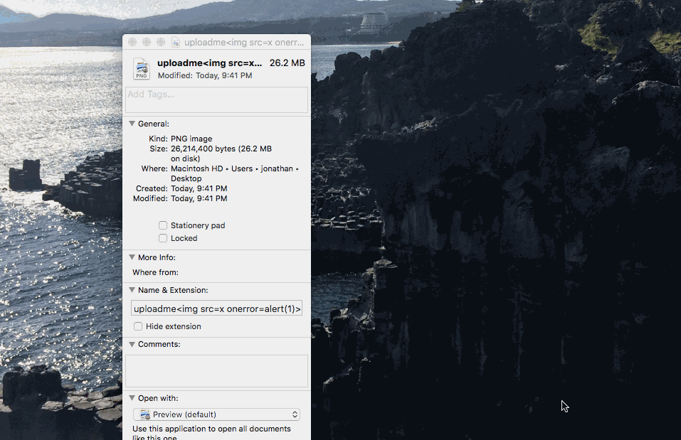
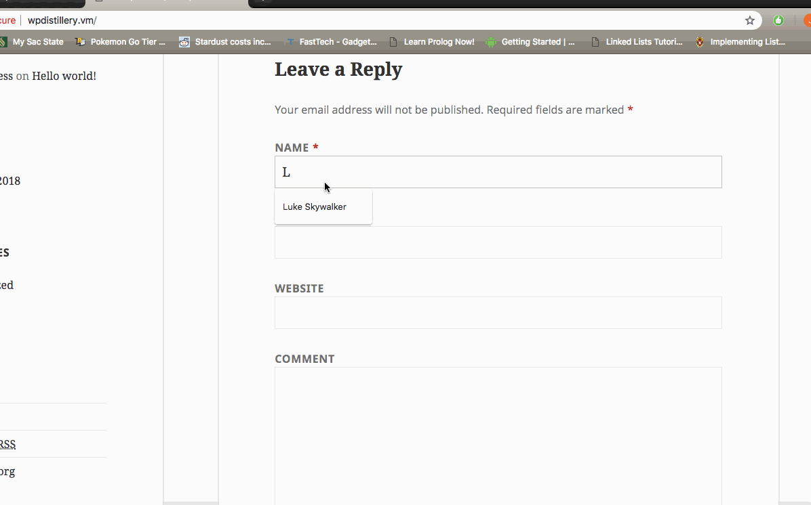
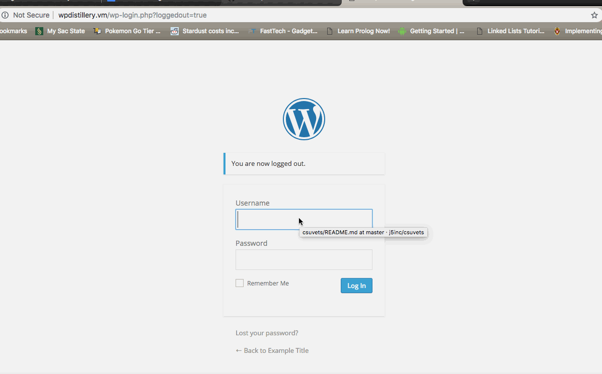
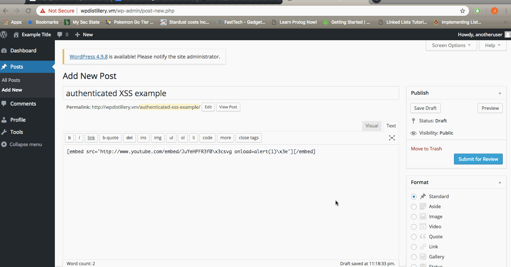

# Project 7 - WordPress Pentesting

Time spent: Approximately 4 hours.

> Objective: Find, analyze, recreate, and document **five vulnerabilities** affecting an old version of WordPress

## Pentesting Report

1. Large File Upload Error XSS
  - [X] Summary: 
    - Vulnerability type: XSS
    - Tested in version: 4.2
    - Fixed in version: 4.2.15
  - [X] GIF Walkthrough:  
  - [X] Steps to recreate: 
     -We need to create a file that is 20 MB or larger. The file name should have the payload script embedded in it.      Example file ~26MB: uploadme.png  
     -The next goal would be to trick an admin of the site to upload the file into the site.  
     -Since the file is larger than 20MB, WordPress reads the file name and executes the script that is embedded.  
     -Report found in WPScan: https://hackerone.com/reports/203515  
  - [X] Affected source code:
    [Link 1](https://core.trac.wordpress.org/browser/trunk/src/wp-includes/script-loader.php)

2. Unauthenticated Stored Cross-Site Scripting  
  - [X] Summary: 
    - Vulnerability type: XSS
    - Tested in version: 4.2
    - Fixed in version: 4.2.1
  - [X] GIF Walkthrough:   
  - [X] Steps to recreate:    
        -Post a comment wtih HTML tags and some type of script. It is important to note that the comment must be                     larger than 64KB.  
       -Example snippit:  
        HTML
        
      
  - [X] Affected source code:
    I could not find affected source code, but there is amplifying information found at:  
    [Link 1](https://packetstormsecurity.com/files/131644/)
    
3. WordPress User Enumeration
  - [X] Summary: 
    - Vulnerability type: User Enumeration
    - Tested in version: 4.2
    - Fixed in version: It is unclear to me when this type of enumeration was patched. One way to fix this is to apply a plugin that outputs a better message when an invalid username/password combo is entered. 
  - [X] GIF Walkthrough:    
  - [X] Steps to recreate:  We can enumerate in this version by simply trying username and password combos. As you can see, in the GIF, when I put in invalid usernames it says "Invalid Username". As soon as I do a valid username with an incorrect password, we are given: "The password you entered for the username enumtestuser is incorrect". By automating something like this, a hacker could potentially guess a valid username.
  
  - [X] Affected source code:  I was not able to locate the exact code responsible. I did find a plugin called "Unified Login Error Messgages" that outputs the message "Invalid username/password combination" when a valid username is entered.
    
4. Authenticated Stored Cross-Site Scripting
  - [X] Summary:  
    - Vulnerability types: XSS
    - Tested in version: 4.2
    - Fixed in version: 4.2.13
  - [X] GIF Walkthrough:   
  - [X] Steps to recreate:  -Make a post on WordPress using a shortcode YouTube link with embedded script.  -The account will need to be at least a contributor.  -To avoid input validation, use \x3c and \x3e as the Javascript escape characters. -Example:  [embed src='http://www.youtube.com/embed/JuYeHPFR3f0\x3csvg onload=alert(1)\x3e'][/embed]

- [X] Affected source code:
    - [Link 1](https://core.trac.wordpress.org/browser/trunk/src/wp-includes/embed.php)

## Assets

26MB dummy file with embedded script for Attack #1.

## Resources

- [WordPress Source Browser](https://core.trac.wordpress.org/browser/)
- [WordPress Developer Reference](https://developer.wordpress.org/reference/)

GIFs created with [LiceCap](http://www.cockos.com/licecap/).

## Notes

One of the challenges I faced is having an older computer. My MacBook has 4GB of RAM and is limiting my ability to seamlessly switch between virtual environments.

## License

    Copyright 2018 Jonathan Neronde

    Licensed under the Apache License, Version 2.0 (the "License");
    you may not use this file except in compliance with the License.
    You may obtain a copy of the License at

        http://www.apache.org/licenses/LICENSE-2.0

    Unless required by applicable law or agreed to in writing, software
    distributed under the License is distributed on an "AS IS" BASIS,
    WITHOUT WARRANTIES OR CONDITIONS OF ANY KIND, either express or implied.
    See the License for the specific language governing permissions and
    limitations under the License.
